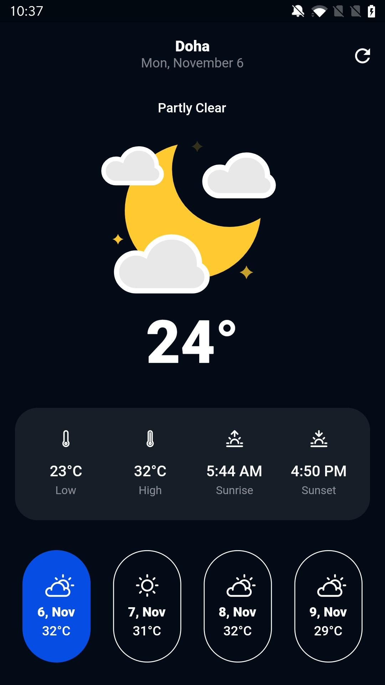
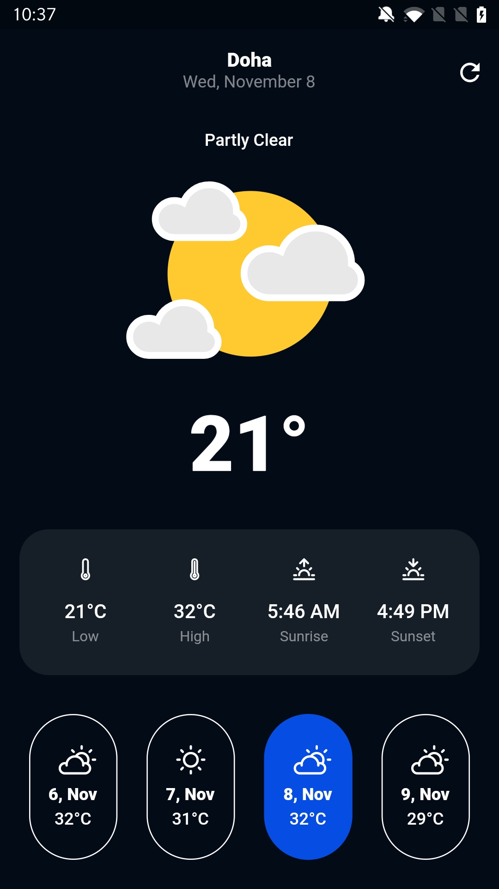

#  Weather App

[](https://flutter.dev/docs/development/tools/sdk/releases)

A simple Flutter project to fetch the current weather deatails along with forecasts for the upcoming three days using your devices location data.

## Setup

### Building the code

Assuming you already have Flutter set up and ready to go, run the pub get command to fetch the dependencies for this project:

```
flutter pub get
```

To build and generate the config files, run this command:

```
flutter pub run build_runner watch --delete-conflicting-outputs
```

### Running the app

Run the app in release mode from your terminal:

```
flutter run --release
```

## Preview

 